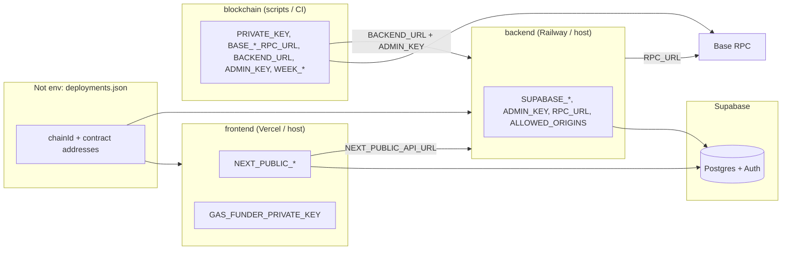

# Environment and deployment wiring

This document lists environment variables used in **backend**, **frontend**, and **blockchain**, how they relate to each other, and how they connect to **Supabase** and on-chain configuration. Use it to keep three separate deploys aligned.

---

## High-level map

---

## 1. Backend (`backend/`)

| Variable | Role | Default / notes |
|----------|------|-----------------|
| `SUPABASE_URL` | Supabase project URL | Required for real DB; otherwise in-memory fallback (`db.py`) |
| `SUPABASE_KEY` | Supabase API key (typically **service role** or **anon** per your security model) | Same project as frontend’s public URL/key pair |
| `ADMIN_KEY` | Shared secret for admin routes | **Must match** `ADMIN_KEY` used by blockchain scripts that call the backend |
| `ALLOWED_ORIGINS` | Comma-separated CORS origins | Include your frontend origin(s), e.g. `https://your-app.vercel.app` |
| `RPC_URL` | JSON-RPC URL for Base (read/write as used in `routes/trading.py`) | Should match the **network** in `deployments.json` (e.g. Base Sepolia → `https://sepolia.base.org` or your provider URL) |

Loaded via `load_dotenv()` in `main.py`.

---

## 2. Frontend (`frontend/`)

| Variable | Role | Default / notes |
|----------|------|-----------------|
| `NEXT_PUBLIC_SUPABASE_URL` | Supabase URL (browser) | **Same project** as backend `SUPABASE_URL` |
| `NEXT_PUBLIC_SUPABASE_ANON_KEY` | Supabase anon key (browser) | Paired with `NEXT_PUBLIC_SUPABASE_URL`; usually **anon** key, not service role |
| `NEXT_PUBLIC_PRIVY_APP_ID` | Privy app id | Set in Privy dashboard for your deployment |
| `NEXT_PUBLIC_API_URL` | Backend base URL | Used in `next.config.js` rewrites (`/api/players`, `/api/trading`, `/api/dividends` → backend). **Must** point to your deployed backend when `NEXT_PUBLIC_DEMO_MODE` is not demo-only |
| `NEXT_PUBLIC_DEMO_MODE` | `true` / `false` | `true` = mock data, no backend required |
| `GAS_FUNDER_PRIVATE_KEY` | Server-only: funds gas (`app/api/fund-gas/route.ts`) | Never prefix with `NEXT_PUBLIC_`; keep only on server env |

**`frontend/.env.example`** also documents `NEXT_PUBLIC_WALLETCONNECT_PROJECT_ID`. The current app uses **Privy** + viem (`app/providers.tsx`); that WalletConnect variable is not referenced in application code—treat it as optional or legacy unless you add RainbowKit-style wiring.

**Build-time note:** `NEXT_PUBLIC_*` values are embedded at build time. Changing them requires a new frontend build.

---

## 3. Blockchain (`blockchain/`)

| Variable | Role | Default / notes |
|----------|------|-----------------|
| `PRIVATE_KEY` | Deployer / signer (64 hex, or `0x` + 64 hex) | Used by Hardhat for `base-sepolia` and `base` (`hardhat.config.js`). Local Hardhat node accounts do not need this |
| `BASE_SEPOLIA_RPC_URL` | RPC for testnet | Defaults to `https://sepolia.base.org` |
| `BASE_RPC_URL` | RPC for Base mainnet | Defaults to `https://mainnet.base.org` |
| `BACKEND_URL` | Base URL for `scripts/distribute-dividends.js` | Defaults to `http://localhost:8000`; set to **production backend** when running that script against prod |
| `ADMIN_KEY` | Same secret as backend admin | Required for `distribute-dividends.js` |
| `WEEK_START` / `WEEK_END` | NBA week window (`YYYY-MM-DD`) | Required for dividend distribution script |
| `RECIPIENT` / `AMOUNT` | Optional | `scripts/mint-usdc.js` only |

**`blockchain/.env.example`** includes `CONTRACT_ADDRESS`; the Hardhat deploy flow does **not** read it—addresses come from **`deployments.json`** after `deploy-statix.js` runs.

---

## 4. Root `/.env` (Docker Compose)

The repo root `.env` is for **local Docker** (see comments in that file): it sets `NEXT_PUBLIC_*`, `FRONTEND_RPC_URL`, `GAS_FUNDER_PRIVATE_KEY`, backend `SUPABASE_*`, `ADMIN_KEY`, `ALLOWED_ORIGINS`, and local Hardhat-style vars (`LOCAL_RPC_URL`, `LOCAL_PRIVATE_KEY`, etc.). It does **not** automatically apply to Vercel/Railway unless you mirror those names there.

---

## Cross-repo: what must stay in sync

### Supabase (database)

| Concern | Backend | Frontend |
|--------|---------|----------|
| Project | `SUPABASE_URL` | `NEXT_PUBLIC_SUPABASE_URL` (same host) |
| Keys | `SUPABASE_KEY` (server) | `NEXT_PUBLIC_SUPABASE_ANON_KEY` (public) |

Use one Supabase project per environment (staging vs production). The **anon** key is safe in the browser; the backend key should be whatever your server needs (often service role for admin tasks—follow Supabase’s guidance for your routes).

### Admin automation

- **`ADMIN_KEY`**: Identical string in **backend** and in **blockchain** env when running `distribute-dividends.js` (or any script that calls admin endpoints).

### Backend URL

- **`NEXT_PUBLIC_API_URL`** (frontend) → must target the same **backend** instance users expect.
- **`BACKEND_URL`** (blockchain scripts) → same logical API when scripts call NBA/stats or admin routes.

### Chain and RPC

- **`backend` `RPC_URL`** should match the chain implied by **`deployments.json`** (`chainId`, `network`).
- **`blockchain` `BASE_SEPOLIA_RPC_URL` / `BASE_RPC_URL`** should be the same network family you deployed to.
- Frontend **chain list** is fixed in code (`baseSepolia`, `base` in `providers.tsx`); `CHAIN_ID` in `lib/abis.ts` comes from **`deployments.json`**, not from env.

### `deployments.json` (not env, but critical)

`blockchain/scripts/deploy-statix.js` writes the same JSON to:

- `blockchain/deployments.json`
- `backend/deployments.json`
- `frontend/deployments.json`
- `frontend/public/deployments.json`

After a new deploy, commit or copy these files (or your CI artifact) so **backend**, **frontend**, and **blockchain** repos all see the same **contract addresses** and **`chainId`**. Env vars do not replace this file.

---

## Keeping three repos “in tune” when deploying separately

1. **One source of truth per environment**  
   Use a spreadsheet or secrets manager row: Supabase URLs/keys, `ADMIN_KEY`, backend URL, RPC URLs, Privy app id, `GAS_FUNDER_PRIVATE_KEY` (if used).

2. **Deploy order (typical)**  
   - Deploy contracts → refresh **`deployments.json`** everywhere (or submodule / shared package).  
   - Set **backend** env (Supabase, `ADMIN_KEY`, `RPC_URL`, `ALLOWED_ORIGINS`).  
   - Set **frontend** env (`NEXT_PUBLIC_*`, especially `NEXT_PUBLIC_API_URL`).  
   - Run **blockchain** scripts only with matching `BACKEND_URL`, `ADMIN_KEY`, and `deployments.json`.

3. **CORS**  
   After frontend URL is final, update **`ALLOWED_ORIGINS`** on the backend.

4. **Smoke checks**  
   - Frontend loads wallet on the chain in `deployments.json`.  
   - API rewrites hit the live backend.  
   - Admin script with `ADMIN_KEY` succeeds against the same backend.

---

## Quick reference: same value across repos

| Concept | Backend | Frontend | Blockchain |
|---------|---------|----------|------------|
| Supabase project URL | `SUPABASE_URL` | `NEXT_PUBLIC_SUPABASE_URL` | — |
| Supabase keys | `SUPABASE_KEY` | `NEXT_PUBLIC_SUPABASE_ANON_KEY` (different key type) | — |
| Admin secret | `ADMIN_KEY` | — | `ADMIN_KEY` |
| Backend base URL | — | `NEXT_PUBLIC_API_URL` | `BACKEND_URL` (scripts) |
| Base RPC (Sepolia) | `RPC_URL` (if Sepolia) | (via viem defaults in app) | `BASE_SEPOLIA_RPC_URL` |

This file reflects the codebase as of the last update; if you add new `process.env` / `os.getenv` usages, extend the tables above.
